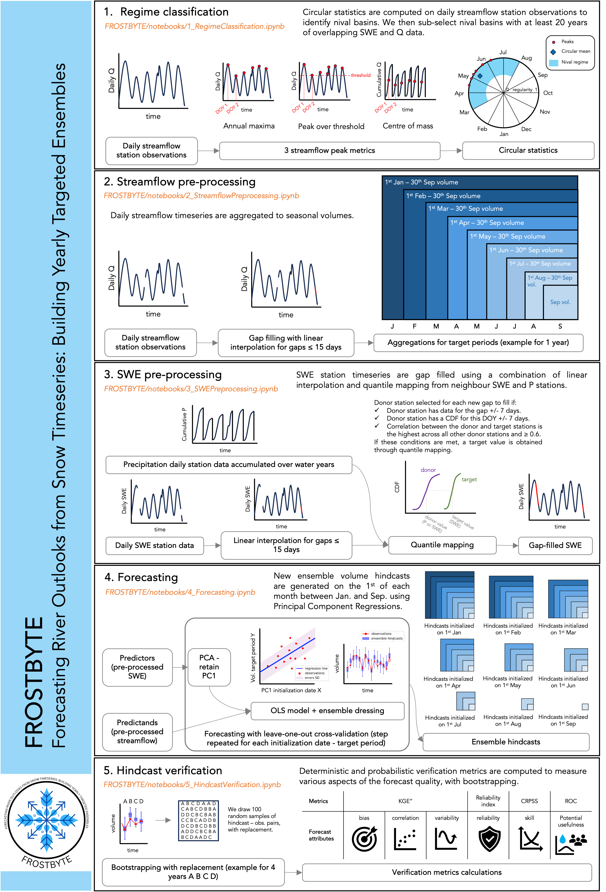

# FROST-BYTE Jupyter Notebooks

To explore FROST-BYTE, the best way is to navigate the Jupyter Notebooks in this section! The image below shows the methods implemented in each notebook. Following that is a brief text description, but open the notebooks themselves to see all steps your yourself.

For installation instructions, refer back to the [landing page](https://github.com/lou-a/FROST-BYTE). Test data has been included for a sample catchment in Canada and in the U.S.

#### 1. Regime Classification (`1_RegimeClassification.ipynb`)

- Regime Analysis using circular statistics to identify nival regimes.
- Data Interpolation with linear interpolation for daily discharge data.
- Expert Knowledge Integration for defining nival regime characteristics.

#### 2. Streamflow Preprocessing (`2_StreamflowPreprocessing.ipynb`)

- Data Interpolation for filling gaps in daily streamflow data.
- Volume Calculation for various target periods within the water year.

#### 3. SWE Preprocessing (`3_SWEPreprocessing.ipynb`)

- Utilizes SWE and precipitation station data for gap filling.
- Employs quantile mapping with neighboring station data for gap filling.
- Includes various data selection and processing parameters.

#### 4. Forecasting (`4_Forecasting.ipynb`)

- Uses PCA for processing SWE data into principal components.
- Employs OLS regression for forecasting.
- Generates ensemble hindcasts with adjustable ensemble size and distribution.

#### 5. Hindcast Verification (`5_HindcastVerification.ipynb`)

- Evaluates ensemble hindcasts using various verification metrics.
- Implements bootstrapping for uncertainty quantification.
- Includes ROC analysis for low and high flow conditions.
