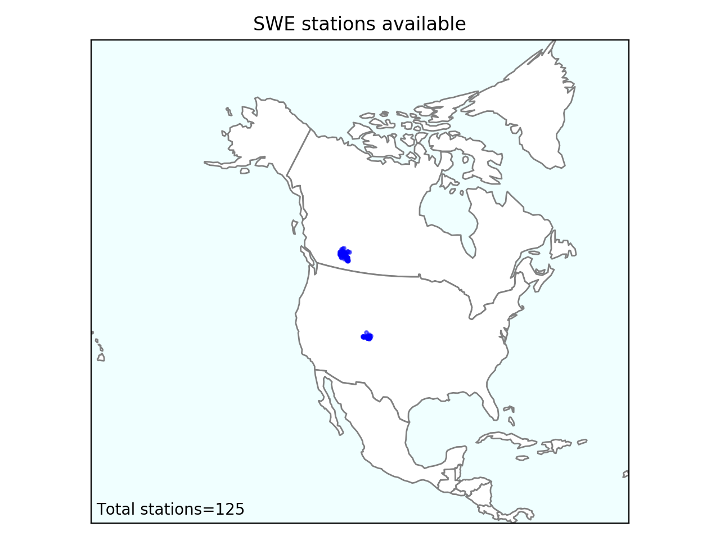

# Test Case Data

Sample data for running the forecasting workflow for two single river basins: the Bow River at Banff in Alberta, Canada (05BB001), and the Crystal River Above Avalanche Creek, Near Redstone in Colorado, USA (09081600). The locations of both are shown in the image below.

