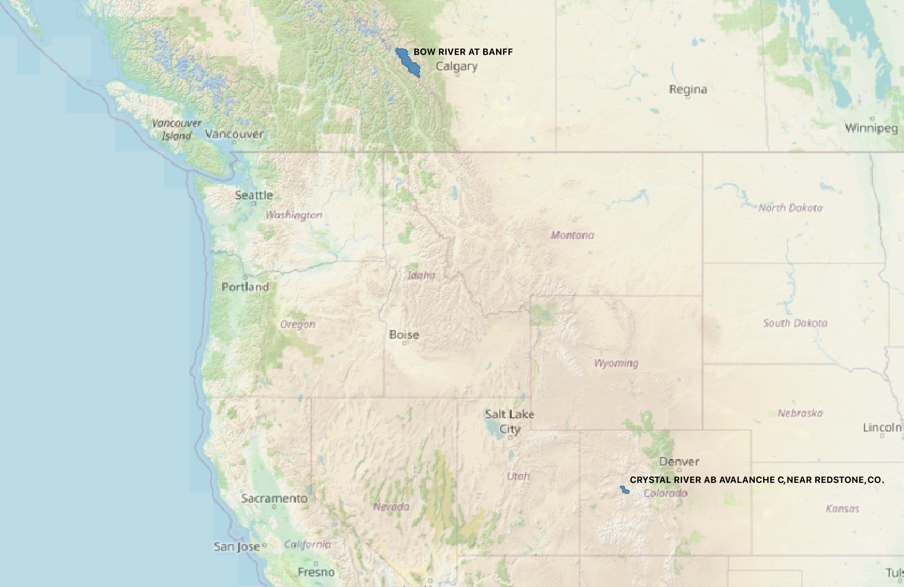

# Test Case Data

Sample data for running the forecasting workflow for two single river basins: the Bow River at Banff in Alberta, Canada, and the Crystal River Abv Avalanche Crk, Near Redstone in Colorado, USA. The locations of both are shown in the image below.

